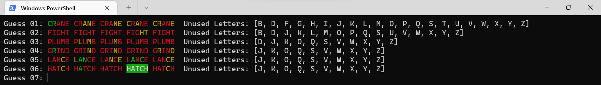
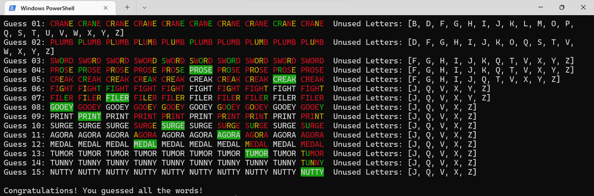

# JavaNWordle Overview
A variation of the popular Wordle game where you can choose the word length(4 or 5 letters), as well 
as the number of words you want to guess. Uses a simple text-based interface with color coding to display
the results as the game progresses(See images below).
## To Run The Program
Clone this repository to your IDE(IntelliJ, VSCode, Eclipse, etc) and then run the NWordle.java file as
that has the main method in it. All extra required files like allWords.txt and guessWords.txt are included
in the git repository so they will be automatically available once the repository is cloned.

